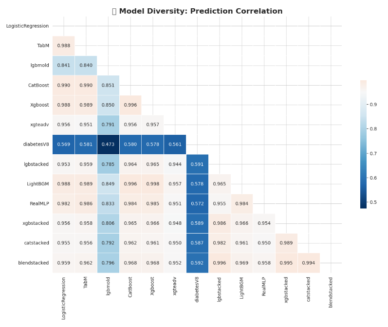

# 🏆 Diabetes Prediction Challenge (S5E12) - Grandmaster Ensemble


## 📌 Overview

This project implements a **Hill Climbing Ensemble** strategy for the **Diabetes Prediction Challenge (Playground Series S5E12)**. The goal is to maximize **ROC AUC** by optimizing the linear weights of a diverse zoo of base models against Out-of-Fold (OOF) predictions.

This approach is a gold-standard technique to minimize overfitting while squeezing out maximum performance from base models by finding the optimal weighted blend.

---

## 📝 Abstract

The core of this solution is **Greedy Hill Climbing Optimization**. Instead of simple averaging, we iteratively adjust the weight of each model in the ensemble. If a weight adjustment improves the Overall OOF AUC, it is kept; otherwise, it is discarded. This ensures that only models contributing unique signal are prioritized.

**Key Objectives:**
1.  Maximize Cross-Validation ROC AUC.
2.  Minimize overfitting to the Public Leaderboard.
3.  Leverage diversity across Gradient Boosting, Deep Learning, and Linear architectures.

---

## 🚀 Key Features

* **Diverse Model Zoo**: Blends predictions from a wide range of architectures including:
    * **Gradient Boosting**: CatBoost, XGBoost, LightGBM
    * **Deep Learning**: TabM (Tabular Modern), RealMLP
    * **Linear Models**: Logistic Regression
    * **Stacked Variants**: `lgbstacked`, `xgbstacked`, `catstacked`
* **Greedy Hill Climbing**: An iterative algorithm that selects model weights to maximize the evaluation metric step-by-step.
* **Safety Mechanisms**: Optimization is performed strictly on cross-validation (OOF) data to prevent leakage.
* **Correlation Analysis**: Includes visualization steps to ensure model diversity before blending.

---

## 🧠 The Ensemble Zoo

The following models are loaded and weighted during the optimization process:

| Model Name | Type | Key Characteristics |
| :--- | :--- | :--- |
| **CatBoost** | GBDT | Strong baseline, handles categorical features well. |
| **XGBoost** | GBDT | Standard and Adversarial (`xgteadv`) variants. |
| **LightGBM** | GBDT | High speed, includes stacked variants. |
| **TabM** | Deep Learning | Tabular Modern architecture for neural diversity. |
| **RealMLP** | Deep Learning | Multi-Layer Perceptron for non-linear patterns. |
| **Logistic Regression** | Linear | Provides a linear baseline to stabilize the ensemble. |
| **DiabetesV8** | Custom | Specialized iteration for this dataset. |

---

## 📊 Visuals & Analysis

### 1. Diversity Check
To ensure the ensemble is effective, we analyze the Pearson correlation between the OOF predictions of different models. Lower correlation implies higher diversity.



### 2. Optimization History
The Hill Climbing algorithm iterates through weights, printing the improvement in AUC score at every step.

---

## 🛠️ Installation & Usage

### Prerequisites
Ensure you have Python 3.10+ and the following libraries installed:

```bash
pip install pandas numpy matplotlib seaborn scikit-learn tqdm
